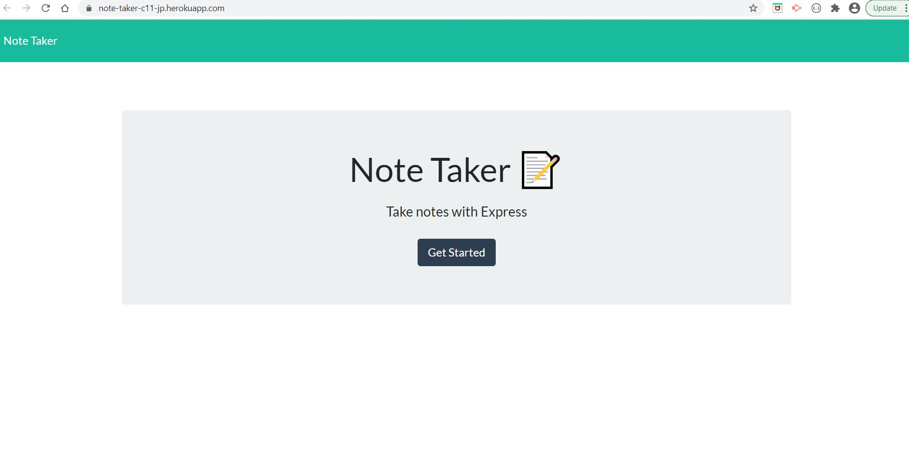
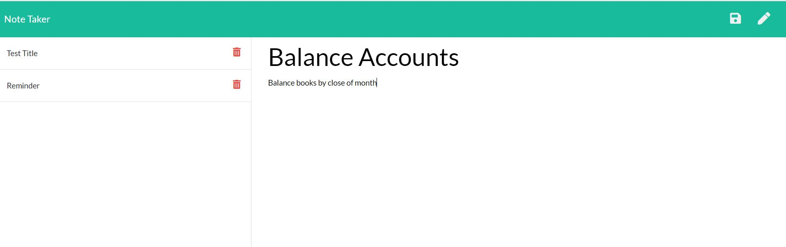

# Note Taker Challenge #11

## Challenge Description:
* jQuery application to take notes
* Title and notes are saved and stored as a sidebar list
* As a new note is entered a save button generates in the top right corner
* An edit button will clear the input fields
* Notes can be selected or deleted from the sidebar
* Final appliation is deployed to Heroku

## Screenshots:

## Links:

#### Link to deployed Heroku application:
* https://note-taker-c11-jp.herokuapp.com/

#### Link to GitHub repository:
* https://github.com/jenlpac/note-taker
